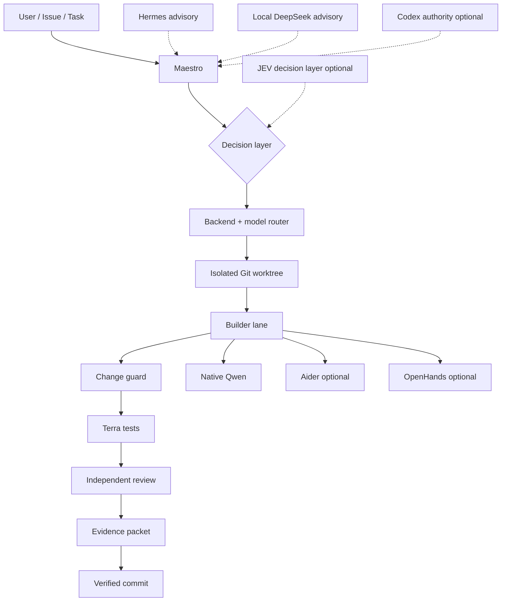

# 🎼 MIGZ AI Orchestra

**Local-first, evidence-driven multi-agent orchestration for software delivery.**

[](https://github.com/migztheanalyst/migz-ai-orchestra/actions/workflows/ci.yml)


MIGZ AI Orchestra turns multiple AI coding tools and local models into a governed delivery pipeline with task isolation, deterministic routing, independent QA, reproducible evidence, bounded fallbacks, and release gates.

It is **not** another chat UI and it is **not** a wrapper that blindly lets agents edit your repository.

The core runs locally with Ollama. Cloud authority and decision layers are optional.

## Why Orchestra?

Most agent stacks optimize for *getting an answer*. Orchestra optimizes for *shipping a change you can inspect, test, reproduce, and reject safely*.

- 🧠 Role-aware model routing
- 🌳 Isolated Git worktrees per task
- 🛡️ Allowed-scope change guard
- 🧪 Independent test + review stages
- 📦 Evidence packets before commit
- 🔁 Bounded retry and fallback behavior
- 🧭 Multi-project scheduler with local concurrency limits
- 🩺 Portable doctor and live provider preflight
- 🔌 Optional Aider, OpenHands, Hermes, Codex, JEV and local DeepSeek integrations
- 🔒 No paid hosted model provider is required by the core

## Architecture



The **control plane** owns task state, routing, safety, evidence, and release decisions. Agent backends never get to silently declare themselves successful.

## Quick start

### Linux / macOS / WSL2

Prerequisites: Git, Python 3.11+, curl, and a running [Ollama](https://ollama.com/download) service.

```bash
git clone https://github.com/migztheanalyst/migz-ai-orchestra.git
cd migz-ai-orchestra
./scripts/setup.sh
./orchestra doctor
```

`setup.sh` creates the local runtime folders and pulls the three core models:

```text
qwen2.5-coder:3b   fast / triage
qwen2.5-coder:7b   coding / review
qwen3.5:4b         reasoning
```

Add the optional local DeepSeek advisory lane with:

```bash
./scripts/setup.sh --with-deepseek
```

### Windows PowerShell

```powershell
git clone https://github.com/migztheanalyst/migz-ai-orchestra.git
cd migz-ai-orchestra
.\scripts\setup.ps1
.\orchestra.ps1 doctor
```

## Run your first task

Create a bounded task:

```bash
./orchestra create \
  --title "Add health endpoint" \
  --objective "Add GET /health with tests. Keep changes inside the application and test folders." \
  --role coding
```

Inspect the queue:

```bash
./orchestra status
```

Run the next task:

```bash
./orchestra run-next
```

See [examples/first-task.md](examples/first-task.md) for a copy-paste walkthrough.

Before trusting a machine for real work, run the live gate once:

```bash
./orchestra doctor --probe
./orchestra preflight
```

Every task moves through the same governed flow: claim → isolated implementation → change guard → tests → review → evidence → commit or block.

## Optional integrations

The public core has no cloud-model requirement. Add integrations only when you want them:

| Integration | Purpose | Core required? |
| --- | --- | --- |
| Codex CLI | Planning / final authority workflows | No |
| JEV / TypeSafe | Typed decision and risk layer | No |
| Aider | Secondary coding backend | No |
| OpenHands | Isolated headless coding backend | No |
| Hermes Agent | Advisory / reasoning agent | No |
| DeepSeek local | Lightweight local advisory lane | No |
| Telegram / War Room | Remote observability surface | No |

See [docs/integrations.md](docs/integrations.md) for supported setup paths and health checks.

## Safety model

Orchestra assumes agents can be wrong. The pipeline is designed around that assumption.

1. A task is explicit and bounded.
2. Implementation happens in an isolated worktree.
3. File changes are checked against allowed scope.
4. Tests execute independently from the builder.
5. Review is a separate stage.
6. Evidence is captured before a verified commit.
7. Failure is terminal unless a bounded retry/fallback rule explicitly applies.

No agent self-report is treated as proof. See [docs/security-model.md](docs/security-model.md).

## Repository map

```text
conductor/   orchestration, routing, safety, scheduling, review
scripts/     setup, smoke, stress and canary utilities
tests/       deterministic regression suite
docs/        architecture, security and integration guides
.github/     CI, security and contribution workflows
examples/    copy-paste task examples
```

Runtime state is intentionally **not committed**. `tasks/`, `state/`, `evidence/`, `logs/`, local credentials and `.env` files are ignored.

## Contributing

Contributions are welcome from anywhere in the world — especially new backends, local-model adapters, safety checks, OS support, documentation and reproducible benchmarks.

Start with:

- [CONTRIBUTING.md](CONTRIBUTING.md)
- [docs/adding-a-backend.md](docs/adding-a-backend.md)
- [ROADMAP.md](ROADMAP.md)
- GitHub issue templates for bugs, features and new integrations

Every PR must keep the default core usable without private credentials and must pass the deterministic test + security gates.

## Release checks

```bash
./orchestra release-check
# On a machine with the local runtime available:
./orchestra release-check --live
```

## License

MIT © 2026 Ahmed Magdy. See [LICENSE](LICENSE).

---

If Orchestra helps your workflow, ⭐ the repository, open an issue with what you built, and help make agentic software delivery safer and more reproducible.
